# p2c2024-RAG-benchmark
Collection of the performance of works done by different teams in Policy2Code challenge 2024
> ⚠️This repository is WIP🚧
## Collection of teams, domains and evaluation method/datasets
|Team|Focused Domain|Best Result|Evaluation|Notes|
|----|--------------|-----------|----------|-----|
|SSI | SSI/SSDI     |PaperQA implementation|MC F1 / Q&A ROUGE|Using our own dataset|

## SSI/SSDI result
detail in directory `SSI-SSDI`

```mermaid
gantt
    title Score of different RAG methods
    dateFormat  X
    axisFormat %s

    section Naive RAG
    Simple MC (F1)         : 0, 83
    Short QA (ROUGE-1)   : 0, 11
    section PaperQA
    Simple MC (F1)         : 0, 92
    Short QA (ROUGE-1)   : 0, 22
    section GraphRAG
    Simple MC (F1)         : 0, 79
    Short QA (ROUGE-1)   : 0, 13
    section Prolog+LLM
    Simple MC (F1)         : 0, 88
    Short QA (ROUGE-1)   : 0, 10
```

