# Collections
## Performance of LLMs
Contributed by BDO Canada
| | Llama 70B | GPT4o + Property Graph | Gemini 1.5 + Property Graph | Gemini 1.5 Direct Query |
|---|---|---|---|---|
| Understanding Legislative and Regulatory Requirements  | ⭐ | ⭐⭐ | ⭐⭐⭐ | ⭐⭐⭐ |
| Simplifying Complex Information                        | ⭐ | ⭐⭐ | ⭐⭐ | ⭐⭐ |
| Legislation and Regulation through a codified language | ⭐ | ⭐ | ⭐ | ⭐⭐⭐ |

## RAG benchmark
Collection of the performance of works done by different teams in Policy2Code challenge 2024

|Team                 |Focused Domain|Best Result|Evaluation |Notes|
|---------------------|--------------|-----------|-----------|-----|
|CodeTheDream         |Medicaid      |With RAG   |Correctness|Correctness is one of the [Evaluation Criterias](https://codethedream.org/wp-content/uploads/2024/09/MFB-AI-Suggested-Evaluation-Rubric-Code-the-Dream.pdf)|
|POMS and Circumstance| SSI/SSDI     |PaperQA    |MC F1 / Q&A ROUGE|Using our own dataset|

### Medicaid result

```mermaid
gantt
    title Score of different RAG methods with GPT-4o
    dateFormat  X
    axisFormat %s

    section No RAG/Prompt
    TestRun1         : 0, 37
    TestRun1_        : 0, 32
    section Only Prompt
    TestRun2         : 0, 60
    TestRun2_LC      : 0, 68
    section RAG+Prompt
    TestRun3         : 0, 89
    TestRun4_LC      : 0, 91
```

> Dataset not published yet

### SSI/SSDI result
detail in directory `SSI-SSDI`

```mermaid
gantt
    title Score of different RAG methods
    dateFormat  X
    axisFormat %s

    section *Perplexity
    Simple MC (F1)         : 0, 98
    Short QA (ROUGE-1)   : 0, 3
    section Naive RAG
    Simple MC (F1)         : 0, 88
    Short QA (ROUGE-1)   : 0, 11
    section PaperQA
    Simple MC (F1)         : 0, 90
    Short QA (ROUGE-1)   : 0, 22
    section GraphRAG
    Simple MC (F1)         : 0, 65
    Short QA (ROUGE-1)   : 0, 13
    section Logic LLM
    Simple MC (F1)         : 0, 88
    Short QA (ROUGE-1)   : 0, 10
    section **PolicyEngine
    Simple MC (F1)         : 0, 45
    Short QA (ROUGE-1)   : 0, 0
```

> *Baseline model, the Short QA using ROUGE-1 may not clearly shows the quality of answer for short QA. 🚧 We will replace it with a large language model judge.

> **We counted "Didn't answer" as incorrect for all models in our F1 score. PolicyEngine got 100% correct in 45 questions and not able to answer other questions as knowledge not implemented by the developer team yet. 0 in short QA just because not yet able to answer short QA before next upgrade.
